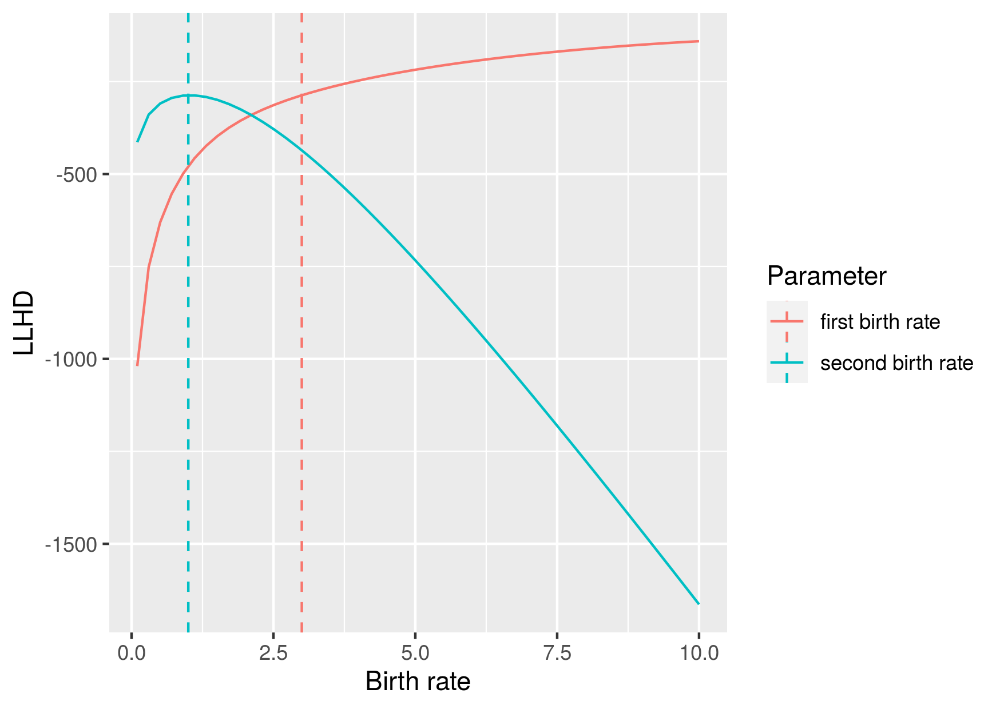

# Simulation Study Time Dependent Rates

## Configuration

```
$ Rscript simulation-study-time-dependent-rates-config.R
```

## Evaluation of the LLHD 

```
$ stack clean
$ stack build 
$ stack exec -- simulation-study-time-dependent-rates
```

## Visualise the LLHD

```
$ Rscript plot-simulation-study-time-dependent-rates.R
```



