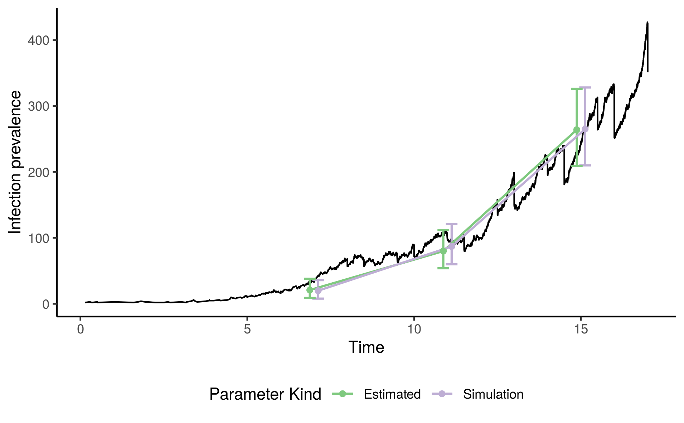

# Simulation Study Time Series

See `run.sh` for the steps involved in running this example. There is a script
`clean.sh` which can be used to clean up intermediate files.

This simulates a data set and then takes portions of the data based on what had
been observed at several points in the simulation. It then evaluaes
log-likelihood profiles both about the actual parameters used in the simulation
and about a MLE estimate of the parameters. The resulting figures appear in
`out/`.

The `src` directory contains some helpful R scripts for both the configuration
of the simulation study and the visualisation of results.

## Example

