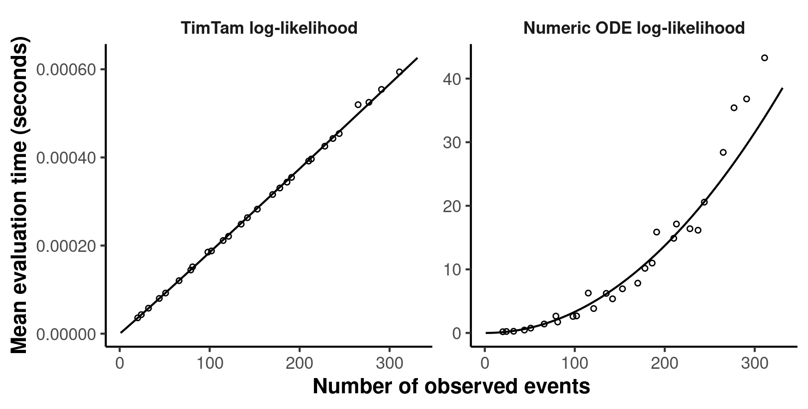
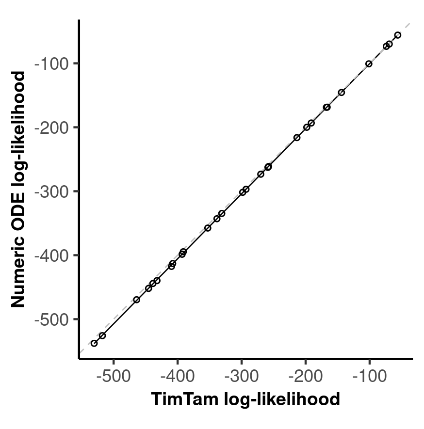
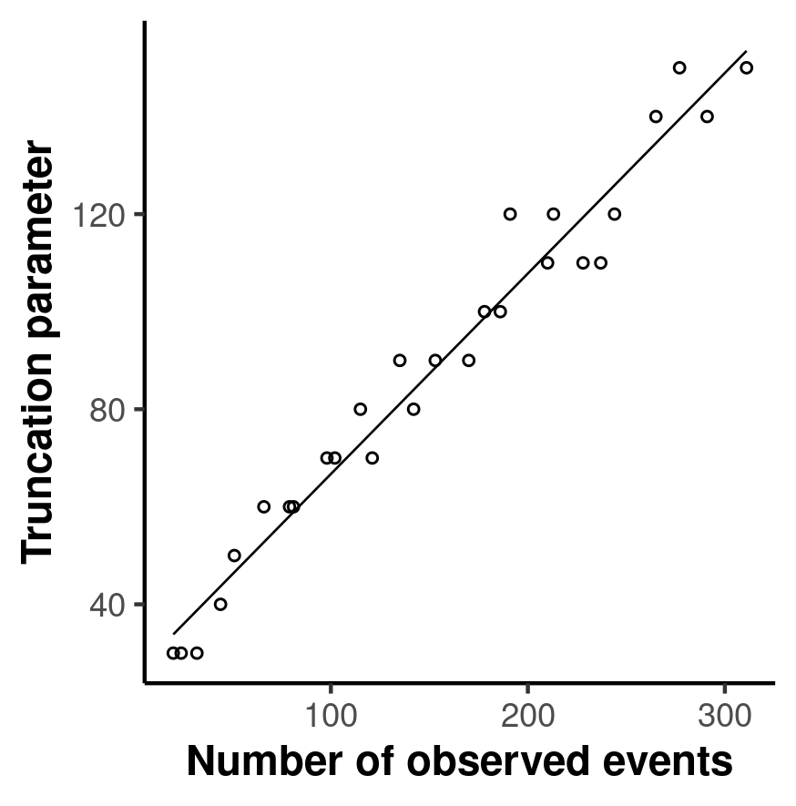

# Timing Evaluation

This examples simulates trees of varying sizes and then times how long it takes
to evaluate the likelihood function on the resulting data set using our
approximattion. There are instructions for timing the evaluation times using the
algorithm described by Manceau /et al/ (2020) as well. We refer to that as the
`popsize-distribution` since that is the name of the repository in which it is
implemented.

## Manceau's LLHD function

To compute the evalaution times for the `popsize-distribuion` function, you need
to clone the correct repository into the current directory and then set up the
necessary python environment (there is a `requirements.txt` provided). Then
after running the BDSCOD timing, you need to adjust the simulation files and run
`run-python-timing.sh` from withing `popsize-distribution` to generate the
timing results.

The output of `pip freeze` for the virtual environment being used is here, i.e.,
the `requirements.txt` is given below.

```
cycler==0.10.0
Cython==0.29.21
ete3==3.1.1
kiwisolver==1.1.0
matplotlib==3.0.3
numpy==1.18.5
pkg-resources==0.0.0
pyparsing==2.4.7
python-dateutil==2.8.1
scipy==1.4.1
six==1.15.0
```

## Parameters

The parameters used in this computation are (unfortunately) hard coded in a few
places, so if you want to change them you need to check they are consistent
across several files.

- `src/prepare-simulations-for-popsize.R`
- `../../apps/timing-evaluation/Main.hs`
- `popsize-distribution/timing.py`

## Running

**REMEMBER TO SOURCE THE VIRTUAL ENVIRONMENT FIRST!**

The profiling of the haskell code is done with `criterion` which provides a CLI
which is why there is long `stack exec` command.

```
stack clean 
stack build 
rm out/*
rm fibber.html 
rm fobber.csv 
stack exec -- timing-evaluation --output fibber.html --csv fobber.csv --time-limit 5 
```

At this point you can open `fibber.html` in a browser to see the report
generated by criterion of how the profiling went. The next steps are used to do
the analogous timing in python.

```
Rscript src/prepare-simulations-for-popsize.R 
source venv/bin/activate
cd popsize-distribution 
./run-python-timing.sh
cd ../ 
```

The `run-python-timing.sh` script just loops over the reformatted files and runs
the `timing.py` script on them. This outputs
`popsize-distribution-timing-<xxx>.json` files which describe the files that
where used, the estimated minimal truncation parameter and the timem associated
with the final evaluation.

The final step is to generate figures to display the results, the first looks at
the comparison of the timing between the two models and evaluates the degree of
a polynomial explaining the complexity, i.e., the order of the complexity. The
second creates a comparison of the LLHDs between the two models and reports the
proportion of the variance in the Manceau LLHD explained by our model. There is
also a figure looking at how the truncation parameter scales with the size of
the dataset.

```
Rscript src/plot-profiles.R
Rscript src/plot-llhds.R
```


## Results

Since the whole point of this is the timing of the two methods, lets look first
at how the timings compare. Note that this figure is produced by
`src/plot-profiles.R`.



But of course, the benefits of a faster algorithm are only meaningful if it
gives the correct results so lets look at a comparison of the LLHD across the
two methods. There appears to be an additive constant that differs between the
two methods, but this wsa also present in Marc's code so I suspect there is
something about nnumerical stability in his code that accounts for this.



Finally, let's consider how the selected truncation parameter differs with the
size of the data set, since this is a novel result too.



